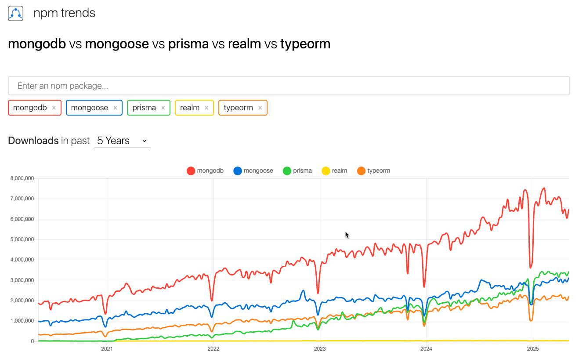

# MongoDB Discovery Project

## Overview
This project contains tests for MongoDB operations using five different implementations:
- **MongoDB Driver**
- **Mongoose**
- **Prisma**
- **Realm**
- **TypeORM**

It includes a test data factory for generating test data for users, folders, and documents.

The main goal of this discovery is to compare these different libraries by writing similar basic tests for each. This approach allows for a practical investigation of the pros and cons of each library in action, helping to highlight their strengths, weaknesses, and unique features in real-world scenarios. It was also important to evaluate the applicability of each library for testing purposes, assessing how well they integrate with [Playwright](https://playwright.dev/docs/intro) and support robust test development.

## Project Overview

### Libraries and Tests

- **[MongoDB Driver](https://mongodb.github.io/node-mongodb-native/)**:  
  The official low-level driver for Node.js, providing direct access to MongoDB databases and collections with full control over queries and operations. Tests are located in `tests/mongodb-driver/`.

- **[Mongoose](https://mongoosejs.com/docs/)**:  
  A popular ODM (Object Data Modeling) library for MongoDB and Node.js. It provides schema-based modeling, validation, and middleware for MongoDB documents. Tests are located in `tests/mongoose/`.

- **[Prisma](https://www.prisma.io/docs/)**:  
  A next-generation ORM for Node.js and TypeScript. Prisma provides a type-safe query builder, migrations, and a modern developer experience for working with databases, including MongoDB. Tests are located in `tests/prisma/`.

- **[Realm](https://www.mongodb.com/docs/realm/sdk/node/)**:  
  A mobile-first database solution that also supports Node.js. Realm is designed for local data storage and real-time synchronization, making it ideal for mobile and offline-first applications. Tests are located in `tests/realm/`.

- **[TypeORM](https://typeorm.io/)**:  
  An ORM for TypeScript and JavaScript (ES7, ES6, ES5). TypeORM supports Active Record and Data Mapper patterns and works with many databases, including MongoDB. Tests are located in `tests/typeorm/`.

### Additional Files
- **`test-data-factory.ts`**: A utility for generating test data for users, folders, and documents.
- **`prisma/schema.prisma`**: The Prisma schema defining the data models for the project.

## Setup Instructions
1. **Install Dependencies**:
   ```bash
   npm install
   ```

2. **Generate Prisma Client**:
   ```bash
   npx prisma generate
   ```

3. **Docker Setup to Run MongoDB**:
   - The project includes a `Dockerfile` and a `docker-compose.yml` file for containerized development and testing.
   - **Windows**:
     - Install [Docker Desktop for Windows](https://www.docker.com/products/docker-desktop).
     - Ensure virtualization is enabled in your BIOS.
     - Start Docker Desktop and wait for it to be ready.
   - **Mac**:
     - Install [Docker Desktop for Mac](https://www.docker.com/products/docker-desktop).
     - Start Docker Desktop and wait for it to be ready.
   - **Running Docker**:
     - Build and start the containers in detached mode using:
       ```bash
       docker-compose up -d
       ```

4. **Run Tests**:
   - To run MongoDB driver tests:
     ```bash
     npx playwright test tests/mongodb-driver
     ```
   - To run Mongoose tests:
     ```bash
     npx playwright test tests/mongoose
     ```
   - To run Prisma tests:
     ```bash
     npx playwright test tests/prisma
     ```
   - To run Realm tests:
     ```bash
     npx playwright test tests/realm
     ```
   - To run TypeORM tests:
     ```bash
     npx playwright test tests/typeorm
     ```

## Test Data Factory
The `TestDataFactory` is a utility class that provides methods to generate test data for users, folders, and documents. It is used in both the MongoDB driver and Prisma tests.

### Usage
- **Creating a User**:
  ```typescript
  const user = TestDataFactory.createUser();
  ```

- **Creating a Folder**:
  ```typescript
  const folder = TestDataFactory.createFolder(user.id);
  ```

- **Creating a Document**:
  ```typescript
  const document = TestDataFactory.createDocument(user.id, folder.id);
  ```

- **Creating Multiple Objects**:
  ```typescript
  const users = TestDataFactory.createUsers(5);
  const folders = TestDataFactory.createFolders(3, user.id);
  const documents = TestDataFactory.createDocuments(10, user.id, folder.id);
  ```

## Comparison

| Library | Pros | Cons |
|---------|------|------|
| **MongoDB Driver** | - Direct access to MongoDB with full control over queries. <br> - Lightweight and fast. | - Requires manual handling of schema and validation. <br> - Less abstraction, more boilerplate code. |
| **Mongoose** | - Schema-based modeling and validation. <br> - Middleware support for hooks and plugins. <br> - Object Modeling: Provides a clear structure for defining data models. <br> - Instance and Static Methods: Allows defining custom methods on models. <br> - Community and Plugins: Large ecosystem of plugins available. <br> - Well documented. <br> - JSON support. | - Can be slower due to abstraction overhead. <br> - Learning curve for complex schemas. <br> - Performance Overhead: Adds a layer of abstraction which may introduce performance penalties. <br> - Rigid Schema: The enforced schema can be seen as limiting in a NoSQL environment. <br> - Complexity: In larger applications with intricate data relationships, managing the Mongoose structure can become cumbersome. <br> - Model middleware/hooks are not user-friendly. |
| **Prisma** | - Type-safe query builder. <br> - Modern developer experience with migrations and seeding. <br> - Strong community support and active development. <br> - Built-in support for transactions and migrations. <br> - Excellent documentation and tutorials. | - Limited support for some MongoDB features. <br> - Requires a schema definition. <br> - Can be complex for beginners. <br> - Performance may be slower compared to direct database access. |
| **Realm** | - Designed for mobile and offline-first applications. <br> - Real-time synchronization. | - Primarily focused on mobile, less mature for Node.js. <br> - Limited community support. |
| **TypeORM** | - Supports multiple databases. <br> - Active Record and Data Mapper patterns. <br> - TypeScript support. <br> - Easy setup. <br> - Promise-based. <br> - Works in NodeJS, Browser, Ionic, Cordova, and Electron. | - Can be complex for simple applications. <br> - Less optimized for MongoDB-specific features. <br> - Completely abandoned by its creator. <br> - Too complex for what it does. <br> - Doesn't really support native JavaScript. <br> - Not proper/real type safety. <br> - Cannot use query on any relation. |

### Relevant Articles
- [MongoDB Node.js Driver](https://mongodb.github.io/node-mongodb-native/)
- [Comparison: MongoDB Driver vs Mongoose](https://www.geeksforgeeks.org/mongoose-vs-mongodb/)
- [Mongoose Documentation](https://mongoosejs.com/docs/)
- [Mongoose vs Prisma](https://medium.com/@ibezimchike/comparing-prisma-and-mongoose-fbc42d069c47)
- [Prisma Documentation](https://www.prisma.io/docs/)
- [Prisma vs TypeORM](https://www.prisma.io/dataguide/types/relational-vs-nosql)
- [Realm Node.js SDK](https://www.mongodb.com/docs/realm/sdk/node/)
- [TypeORM Documentation](https://typeorm.io/)
- [Mongoose vs TypeORM](https://stackshare.io/stackups/mongoose-vs-typeorm)

### Comparison by Features

| Feature | MongoDB Driver | Mongoose | Prisma | Realm | TypeORM |
|---------|---------------|----------|--------|-------|---------|
| **Schema** | No predefined schema, flexible. | Enforces schema with data types and validation. | Requires schema definition. | Flexible, supports dynamic schemas. | Supports schema definition with decorators. |
| **Performance** | High performance, direct access. | Slightly slower due to abstraction. | Optimized for performance. | Fast for mobile applications. | Can be slower for complex queries. |
| **Ease of Use** | Requires more manual handling. | User-friendly with built-in features. | Modern and intuitive. | Easy to use for mobile apps. | Complex for beginners. |
| **Community Support** | Strong community support. | Large community and plugins. | Growing community. | Limited community support. | Active community. |
| **Use Case** | Direct database manipulation. | Schema-based applications. | Modern applications with TypeScript. | Mobile and offline-first apps. | Multi-database applications. |

## NPM Trends Statistics



| Library | Stars | Issues | Version | Updated | Created | Size |
|---------|-------|--------|---------|---------|---------|------|
| **MongoDB** | 10,125 | 21 | 6.16.0 | 20 days ago | 14 years ago | [Install size](https://packagephobia.com/result?p=mongodb) |
| **Mongoose** | 27,220 | 220 | 8.14.2 | 3 days ago | 14 years ago | [Install size](https://packagephobia.com/result?p=mongoose) |
| **Prisma** | 42,202 | 2,286 | 6.7.0 | 12 days ago | 9 years ago | [Install size](https://packagephobia.com/result?p=prisma) |
| **Realm** | 5,893 | 614 | 12.14.2 | a month ago | 12 years ago | [Install size](https://packagephobia.com/result?p=realm) |
| **TypeORM** | 35,296 | 2,468 | 0.3.23 | 4 days ago | 9 years ago | [Install size](https://packagephobia.com/result?p=typeorm) |

For more detailed statistics and trends, visit [NPM Trends](https://npmtrends.com/mongodb-vs-mongoose-vs-prisma-vs-realm-vs-typeorm).
